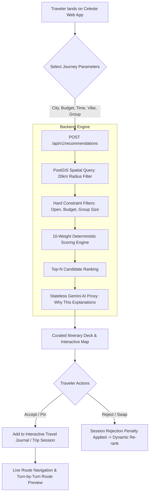
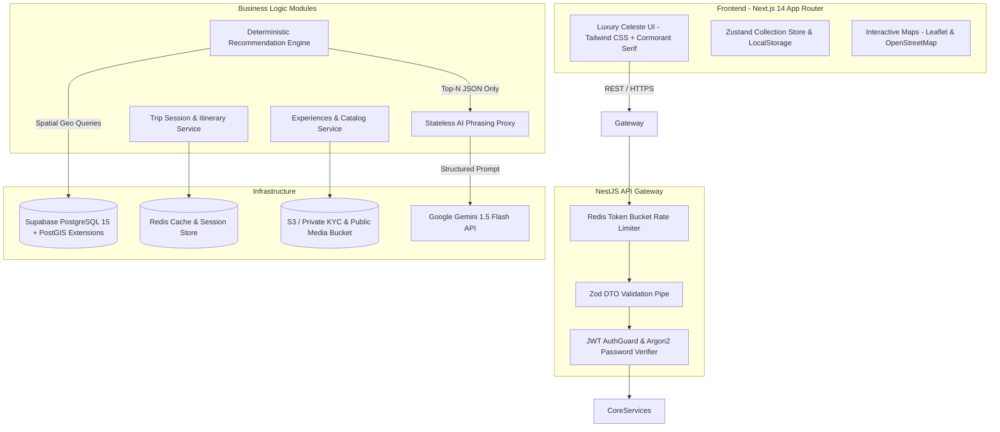

# HackCelestial 3.0 — Presentation Dossier & Pitch Guide

> **Institution**: Mahatma Education Society's Pillai University  
> **Event**: HackCelestial 3.0 (Tech-Alegria)  
> **Project**: Celeste — Local Experience Intelligence & Smart Itinerary Platform  
> **Repository**: `local-experience-intelligence-platform`

---

## Slide 1: Identification, Focus Area & Pitch Summary

### 01. Identification
* **Team Name**: BigSmokeweb (or your designated team name)
* **Project Name**: Celeste (Local Experience Intelligence Platform)
* **GitHub Repository**: `https://github.com/BigSmokeweb/Hackathon`
* **Live Deployment**: `https://experience-platform-sigma.vercel.app/`

### 02. Focus Area / Problem Statement Title
* **Problem Statement**: Hyper-Local Experience Discovery, Dynamic Route Optimization & Verified Artisan Marketplace for Cultural Tourism in India.

### 03. Pitch Summary / Abstract *(Exact 96 words)*
> Most travel platforms rely on commercialized, SEO-bloated listicles that trap travelers in tourist crowds while overlooking verified cultural artisans and hidden gems. Celeste solves this through a dual-engine architecture: a deterministic PostGIS spatial filtering and mathematical scoring engine paired with an isolated, privacy-compliant AI phrasing proxy. Travelers receive real-time, weather-adaptive itineraries with budget and time continuity constraints, while verified local hosts manage authentic offerings backed by Argon2 authentication, Supabase Postgres, and strict KYC verification. The result is a resilient, sub-second discovery engine empowering local tourism with zero hallucinations and complete DPDP privacy compliance.

---

## Slide 2: Proposed Solution

### Detailed Explanation of the Proposed Solution
Celeste is an end-to-end local experience intelligence platform and marketplace connecting travelers seeking authentic, curated cultural activities with verified local artisans and hosts across Indian heritage cities (Mumbai, Jaipur, Ahmedabad, etc.).

1. **Deterministic 10-Factor Scoring Engine**:
   - Rather than letting non-deterministic LLMs hallucinate venues or calculate distances, candidate discovery uses **PostGIS spatial geography queries (`geography(Point, 4326)`)** for instant radius search.
   - A multi-parameter scoring formula balances spatial proximity, budget elasticity, intent match, authenticity rating, time availability, route continuity, and rejection penalties.
2. **Stateless AI Phrasing Proxy**:
   - Google Gemini is decoupled from ranking or database authorization. It exclusively generates personalized, natural-language *"Why this matches you"* contextual explanations and weather-adaptive suggestions, falling back to cached templates if offline.
3. **Live Ephemeral Journey & Itinerary Planner**:
   - Travelers assemble multi-stop itineraries with interactive Leaflet/MapLibre route navigation, travel time budgeting, and real-time transit calculation.
4. **Host Guild Portal with Verified KYC**:
   - Local providers upload experience offerings with structured availability rules and time slots, secured by private KYC document storage and Argon2 password hashing.

### How it Addresses the Core Problem
- **Eliminates Tourist Traps**: Ranks experiences on an **Authenticity Rating (0.0 to 1.0)** vetted through peer reviews, not paid ad bidding.
- **Solves Traveling Fatigue**: Ensures route continuity, preventing back-and-forth transit across cities.
- **Protects User Privacy**: Fully compliant with India's **Digital Personal Data Protection (DPDP) Act** — anonymizes GPS locations into coarse hashes, never storing raw traveler tracking trails.
- **Reliability Guarantee**: Deterministic mathematical filters ensure users never receive closed, out-of-budget, or inaccessible recommendations.

---

## Slide 3: Flow Chart / Architecture

### 1. Software Operational Flow (Start to Finish)

### 2. High-Level Architecture Diagram

---

## Slide 4: Innovation & Unique Functionality

### Innovative Aspects
1. **Isolated 2-Layer Recommendation Architecture**:
   - **Layer 1 (Deterministic)**: 100% mathematical, sub-10ms PostGIS geo-filtering + multi-factor scoring. Zero hallucination.
   - **Layer 2 (Generative)**: Stateless LLM phrasing proxy that receives only pre-ranked structured JSON to synthesize human-like reasoning. If the AI service is offline, the platform degrades gracefully without downtime.
2. **DPDP-Compliant Privacy Engineering**:
   - Raw GPS coordinates are strictly ephemeral during active trip navigation. All persisted recommendation logs convert coordinates into coarse geohashes, safeguarding traveler location privacy under India's Digital Personal Data Protection Act.
3. **Session-Scoped Rejection Learning**:
   - Swiping or rejecting an activity immediately applies a configurable penalty weight ($w_{10}$) inside the ephemeral trip session without permanently tainting the user's global profile.

### Unique Features
- **Dynamic Weather-Adaptive Rerouting**: Classifies experiences into `INDOOR`, `OUTDOOR`, and `WEATHER_DEPENDENT`, adjusting itinerary scoring when rain or severe heat occurs.
- **Lightweight Interactive Password Strength & Argon2id Hashing**: High-grade enterprise cryptography replacing outdated MD5/SHA hashes.
- **Provider Guild & Zero-Knowledge KYC**: Secure 15-minute signed URLs for government ID and GST certificate verification with restricted bucket access.
- **Curated Travel Journal & Offline Collections**: Slide-over itinerary drawer with instant route recalculation and bookmarking.

---

## Slide 5: Technical Details

### Frameworks & Technologies
| Tier | Technology | Purpose |
| :--- | :--- | :--- |
| **Frontend** | **Next.js 14 (App Router)**, React 18, TypeScript | SSR/ISR rendering, dynamic metadata, zero-CLS pages |
| **Styling & UI** | **Tailwind CSS**, Lucide Icons, Cormorant & Manifold Typography | Bespoke luxury aesthetic (`#F5F1E6` Cream, `#347F8C` Teal, Gold accents) |
| **Mapping** | **Leaflet / React-Leaflet**, OpenStreetMap tiles | Interactive route previews, custom pin overlays, geocoding |
| **Backend** | **NestJS 10**, Express, TypeScript | Modular architecture, dependency injection, enterprise guards |
| **Database & ORM**| **Supabase PostgreSQL**, **PostGIS (`geography`)**, **Prisma ORM** | Spatial indexing, ST_DWithin queries, schema migrations |
| **Security & Auth**| **Argon2id**, Passport JWT, Zod, Helmet, sanitize-html | Zero plain passwords, strict sanitization, CSP headers |
| **Caching & Rate Limit**| **Redis (ioredis)**, NestJS Throttler | Token bucket rate limiting, session caching |
| **Generative AI**| **Google Gemini API (@google/genai)** | Natural language explanation proxy |

### Deployment Setup
* **Frontend**: Deployed on **Vercel Edge Network** with automatic ISR caching, dynamic OpenGraph, and asset compression.
* **Backend API**: Containerized with **Docker**, deployable on **Railway / Render / AWS ECS**.
* **Database**: **Supabase Managed Postgres (Tokyo `aws-0-ap-northeast-1`)** with direct connection pooling (port `6543` / `5432`).
* **Storage**: S3-compatible MinIO / Supabase Storage for KYC documents and media.

### Cost Breakdown (Rough Operational Estimate for 10,000 MAU)
| Component | Tier / Service | Monthly Cost (USD) |
| :--- | :--- | :--- |
| Frontend Hosting | Vercel Hobby / Pro | **$0 – $20** |
| Backend Compute | Railway / Render Server (1GB RAM, 1 vCPU) | **$7 – $15** |
| Database | Supabase Free / Pro Tier (500MB+ PostGIS storage) | **$0 – $25** |
| Cache | Upstash Redis Serverless | **$0 – $5** |
| AI Reasoning | Google Gemini 1.5 Flash (Free tier / Pay-as-you-go) | **$0 – $8** |
| **Total Estimated Cost** | **Ultra-lean, serverless-first setup** | **~$15 – $65 / month** |

---

## Slide 6: Existing Solutions & Comparison

| Evaluation Feature | Traditional Aggregators (TripAdvisor, MakeMyTrip) | Pure AI Trip Planners (RoamAround, Mindtrip) | **Celeste (Our Solution)** |
| :--- | :---: | :---: | :---: |
| **Recommendation Engine** | Sponsored ad-bidding, popularity bias | Pure LLM generation (hallucination risk) | **Deterministic 10-Factor PostGIS Engine + AI Phrasing** |
| **Artisan & Host Verification** | Unvetted crowdsourcing or commercial vendors | None (pulls outdated web scraped data) | **Host Guild KYC Verification with document validation** |
| **Spatial & Route Continuity** | Static lists; traveler manually maps routes | Frequent impossible transit paths | **Real-time geographic radius + route continuity scoring** |
| **Data Privacy (DPDP Compliance)**| Extensive tracking, ad retargeting cookies | Variable / third-party analytics | **Coarse location hashing; no raw GPS logging** |
| **Offline / Fallback Resilience** | Requires full connection | Breaks completely on API quota/outage | **Graceful fallback to deterministic template reasoning** |
| **Security Standard** | Standard web auth | Often basic auth or third-party wrappers | **Argon2id hashing, TOTP MFA, strict CSP, Trusted Types** |

---

## Slide 7: Supplementary Information

### Demo Video Link
* **Walkthrough Demo Video**: `[Insert YouTube / Google Drive Link Here]`
* *Recommended format: 2-3 minute loom showing Register/Login, Traveler Itinerary Generation, Interactive Map, and Host Portal.*

### Live Website & Source Code Links
* **Live Website**: [https://experience-platform-sigma.vercel.app/](https://experience-platform-sigma.vercel.app/)
* **GitHub Repository**: [https://github.com/BigSmokeweb/Hackathon](https://github.com/BigSmokeweb/Hackathon)
* **API Documentation**: Accessible at `/api/docs` (Swagger OpenAPI)

---

## Quick Reference: 30-Second Elevator Pitch Script
> *"Good morning judges. Traditional travel apps push commercialized tourist traps, while modern AI trip planners hallucinate fake locations and ignore real-world geography. We built **Celeste** — an intelligent local experience platform designed for India's cultural tourism. Celeste replaces AI guesswork with a deterministic 10-factor scoring engine powered by Supabase PostGIS, paired with an isolated Gemini AI phrasing proxy for natural explanations. With Argon2-secured authentication, full DPDP privacy compliance, and a dedicated Artisan Guild portal, Celeste delivers personalized, verified, and route-optimized journeys in under 200 milliseconds. Thank you!"*
